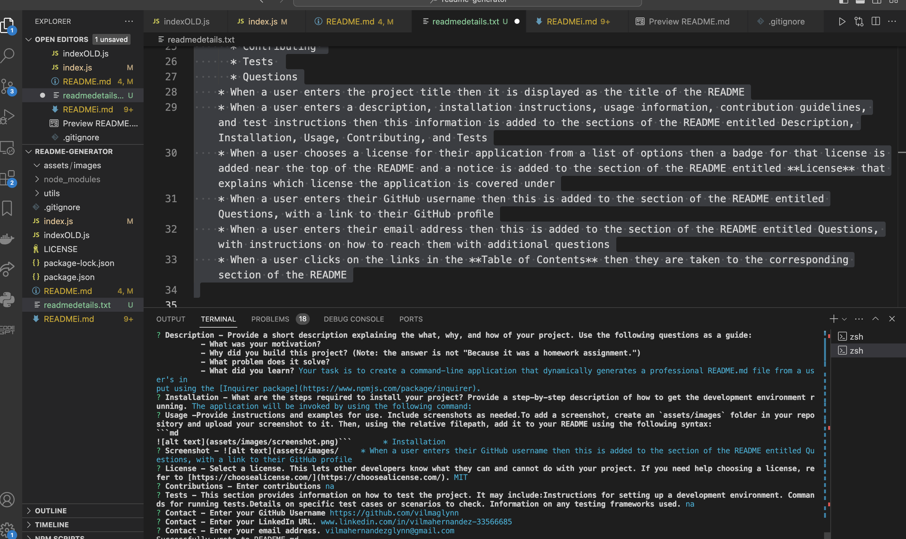

# Readme generator

## Description

Task is to create a command-line application that dynamically generates a professional README.md file from a user's input using the [Inquirer package](https://www.npmjs.com/package/inquirer). 

## Table of Contents

- [Installation](#installation)
- [Usage](#usage)
- [License](#license)
- [Contributing](#contributing)
- [Tests](#tests)
- [Questions](#questions)

## Installation

- **Step 1:** Clone the repository from GitHub. git clone https://github.com/your-username/your-project.git- **Step 2:** Navigates into the project directory.- **Step 3:** Installs the project dependencies using npm.- **Step 4:** Configures any necessary environment variables.- **Step 5:** Provides instructions for setting up the database (if applicable).- **Step 6:** Runs the application.- **Step 7:** Opens the application in the browser.

## Usage

na

## License

MIT
For details of this license please view link below
https://opensource.org/licenses/MIT;

## Contributing

na

## Tests

test1: can be invoked when entering node index.js,- test2: all questions open and allows you to enter details, test3: list of licenses appear, test4: a badge appear for the license, test4: details of license appears within section, test5 a readme files is successfully created

## Questions

Github: https://github.com/vilmaglynn

LinkedIn: www.linkedin.com/in/vilmahernandez-33566685

Email: vilmahernandezglynn@gmail.com
